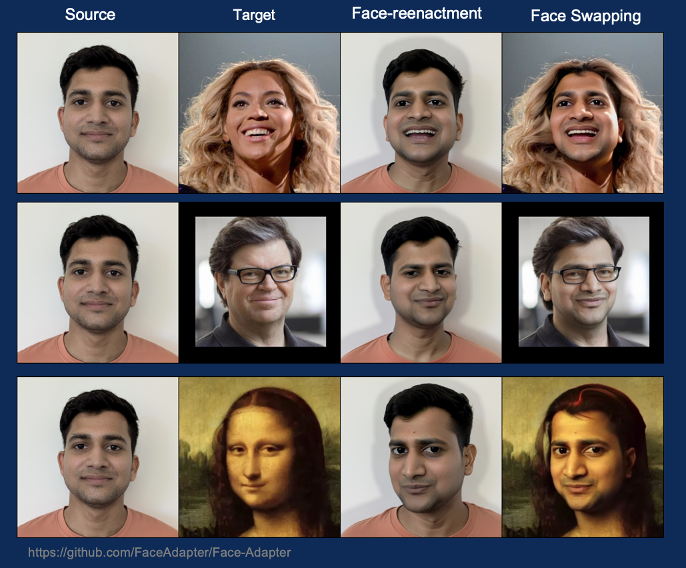
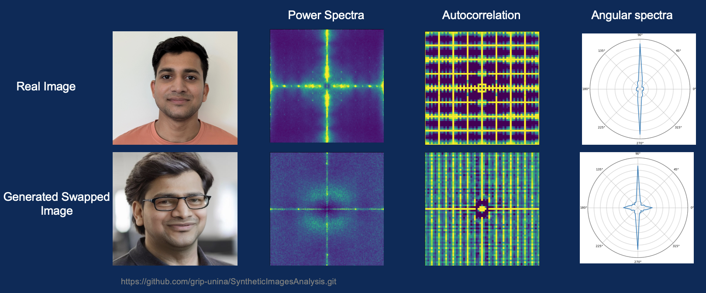
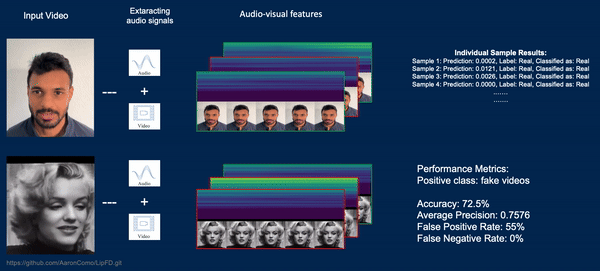

# Deepfake Generation and Detection

This repository contains work from a project focused on **Deepfake Generation and Detection**, showcasing cutting-edge methods for creating and identifying synthetic media. The project explores **two generation** and **two detection methods** using advanced techniques in AI, presenting their results and implications.

---

## Overview

The primary goal of this project was to:
1. Experiment with two deepfake generation models to create synthetic content.
2. Evaluate two deepfake detection models to analyze their ability to identify forgeries.

Each method was implemented and evaluated using datasets and experimental configurations designed to provide robust results. The generated content and detection experiments were conducted using images and videos involving me and my dorm friends.

---

## Results

### Deepfake Generation

#### **Face Adapter**
Using a pre-trained diffusion model, the **Face Adapter** method was employed for face reenactment and swapping. The results, shown below, involve images of me and my dorm friends:



#### **Latent Image Animator (LIA)**
The **Latent Image Animator** was used to create animations by transferring motion patterns. This GIF demonstrates its results using friends' images:


---

### Deepfake Detection

#### **Synthetic Image Analysis**
This detection method revealed that synthetic images created by different generative models exhibit unique fingerprints or signatures, as seen below:



#### **Lip Forgery Detection (LipFD)**
The **LipFD** method identified inconsistencies in lip-syncing between audio and visual data, allowing for the detection of fake and real videos. Below is an example of the detection process:



Both generation and detection experiments utilized the same set of friends for consistency.

---

## Project Structure

```
Deepfake-Generation-and-Detection/
│
├── Deepfake-Generation/
│   ├── Project1/
│   ├── Project2/
│
├── Deepfake-Detection/
│   ├── Project3/
│   ├── Project4/
│
└── README.md

```

---

## How to Use

### Prerequisites
- Python 3.x
- PyTorch
- Additional dependencies listed in each method's subfolder.


---

## Acknowledgments

The experiments involved methods from the following papers:
1. **Face Adapter for Pre-Trained Diffusion Models with Fine-Grained ID and Attribute Control.**
2. **Latent Image Animator: Learning to Animate via Latent Space Navigation.**
3. **Intriguing Properties of Synthetic Images: From Generative Adversarial Networks to Diffusion Models.**
4. **Lips Are Lying: Spotting the Temporal Inconsistency between Audio and Visual in Lip-Syncing DeepFakes.**

Special thanks to my dorm friends for participating in the experiments.
